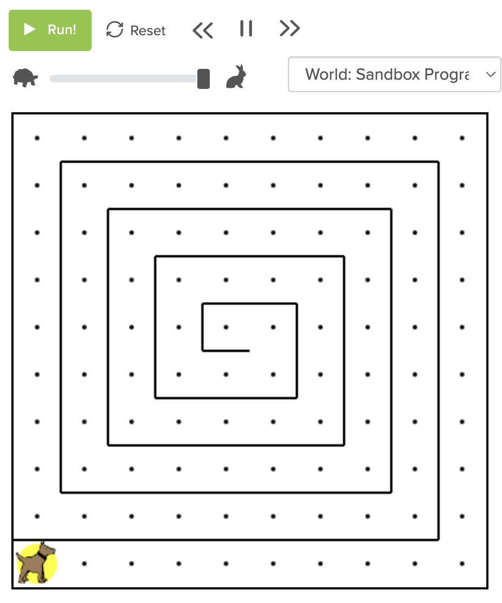
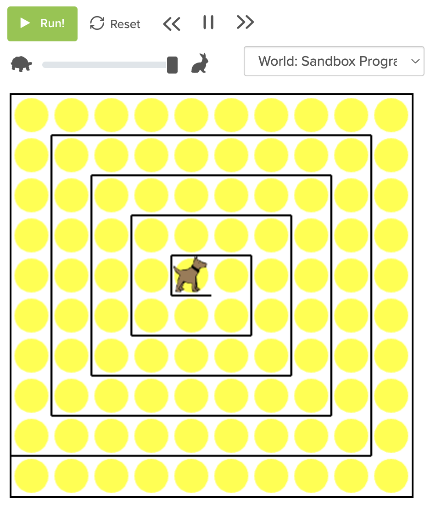

# Spiral Solution

The starting point to the maze looks like the left, the final is the right. What is the minimum amount of lines to solve the maze, put a ball on each spot and face East? [Go to the challenge on CodeHS](https://codehs.com/sandbox/mkreier2022/mastery-check-module-2-challenge-218)

 

## Shortest solution: 5 lines from Hajoon

``` py
for i in range(20):
    while front_is_clear():
        move()
        put_ball()
    turn_left()
```

## Without conditional statements (if or while): 6 lines 

``` py
x = [9,9,9,8,8,7,7,6,6,5,5,4,4,3,3,2,2,1,1,0]
for k in range(len(x)):
    for j in range(x[k]):
        move()
        put_ball()
    turn_left()
```

## No conditional statements (if or while) allowed

### 11 lines by Alex

``` py
for i in range(9):
    move()
    put_ball()
turn_left()
for i in range(9):
    for j in range(2):
        for k in range(9-i):
            move()
            put_ball()
        turn_left()
turn_left()
```

### 10 lines by Thai

``` py
row, repeat = 9, 3
for i in range(9):
    for j in range(repeat):
        for k in range(row):
            move()
            put_ball()
        turn_left()
    repeat = 2
    row -= 1
turn_left()
```

### 9 lines update

``` py
repeat = 3
for i in range(9,0,-1):
    for j in range(repeat):
        for k in range(i):
            move()
            put_ball()
        turn_left()
    repeat = 2
turn_left()
```

### 8 lines - Wayne 2022/09/20

``` py
def lane(y):
    for banana in range(y):
        move()
        put_ball()
    turn_left()
lane(9)
for i in range(19):
    lane(-1 * (i/2 - 9))
```

### 5 lines are possible!

``` py
def is_this_doable?
```


## General code - 218 lines of instruction

Just for completeness: With low level of abstraction the code is 218 commands long:

``` py
move()
put_ball()
move()
put_ball()
move()
put_ball()
move()
put_ball()
move()
put_ball()
move()
put_ball()
move()
put_ball()
move()
put_ball()
move()
put_ball()
turn_left()
move()
put_ball()
move()
put_ball()
move()
put_ball()
move()
put_ball()
move()
put_ball()
move()
put_ball()
move()
put_ball()
move()
put_ball()
move()
put_ball()
turn_left()
move()
put_ball()
move()
put_ball()
move()
put_ball()
move()
put_ball()
move()
put_ball()
move()
put_ball()
move()
put_ball()
move()
put_ball()
move()
put_ball()
turn_left()
move()
put_ball()
move()
put_ball()
move()
put_ball()
move()
put_ball()
move()
put_ball()
move()
put_ball()
move()
put_ball()
move()
put_ball()
turn_left()
move()
put_ball()
move()
put_ball()
move()
put_ball()
move()
put_ball()
move()
put_ball()
move()
put_ball()
move()
put_ball()
move()
put_ball()
turn_left()
move()
put_ball()
move()
put_ball()
move()
put_ball()
move()
put_ball()
move()
put_ball()
move()
put_ball()
move()
put_ball()
turn_left()
move()
put_ball()
move()
put_ball()
move()
put_ball()
move()
put_ball()
move()
put_ball()
move()
put_ball()
move()
put_ball()
turn_left()
move()
put_ball()
move()
put_ball()
move()
put_ball()
move()
put_ball()
move()
put_ball()
move()
put_ball()
turn_left()
move()
put_ball()
move()
put_ball()
move()
put_ball()
move()
put_ball()
move()
put_ball()
move()
put_ball()
turn_left()
move()
put_ball()
move()
put_ball()
move()
put_ball()
move()
put_ball()
move()
put_ball()
turn_left()
move()
put_ball()
move()
put_ball()
move()
put_ball()
move()
put_ball()
move()
put_ball()
turn_left()
move()
put_ball()
move()
put_ball()
move()
put_ball()
move()
put_ball()
turn_left()
move()
put_ball()
move()
put_ball()
move()
put_ball()
move()
put_ball()
turn_left()
move()
put_ball()
move()
put_ball()
move()
put_ball()
turn_left()
move()
put_ball()
move()
put_ball()
move()
put_ball()
turn_left()
move()
put_ball()
move()
put_ball()
turn_left()
move()
put_ball()
move()
put_ball()
turn_left()
move()
put_ball()
turn_left()
move()
put_ball()
turn_left()
turn_left()
```
